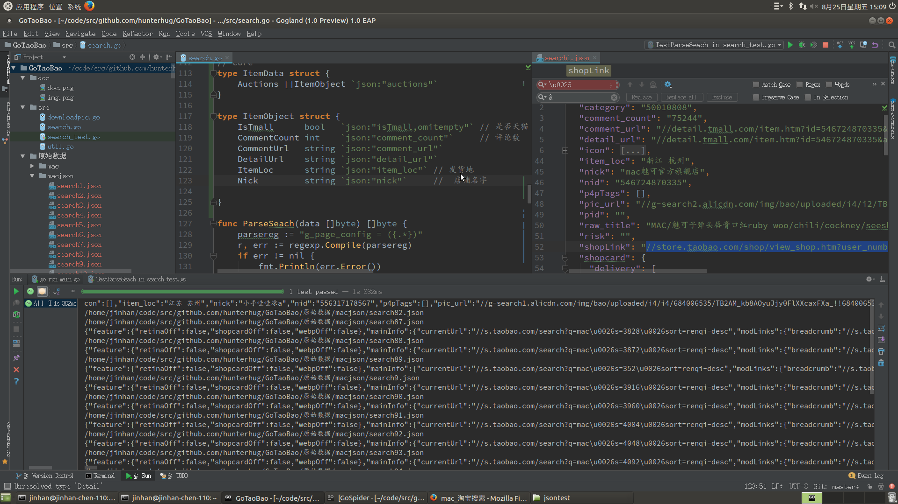

# 淘宝天猫商品信息采集小工具

使用速度快的Golang语言，编译成单一exe二进制文件，方便快捷！

依赖[Project:Marmot(Tubo) - Golang Web Spider/Crawler/Scrapy Package | 爬虫库 ](https://github.com/hunterhug/GoSpider)

开发中～

## 项目情况

请安装Golang环境，然后直接`./build.sh`，直接点击二进制，如`exe`即可

运行命令行显示类似：

```
$ ./GoTaoBao_linux_amd64 

        ---------------------------------------------
        |       亲爱的朋友，你好！
        |       欢迎使用皮卡秋秋制作的小工具
        |       友好超乎你想象！
        |       如果觉得好，给我一个star！
        |       https://github.com/hunterhug/GoTaoBao
        |       QQ：459527502
        ---------------------------------------------
        

        -------温柔的提示框---------
        |天猫淘宝搜索框小工具: 请按 1 |
        |天猫淘宝啥图片小工具: 请按 2 |
        |天猫淘主图视频小工具: 请按 3 |
        |更多待续更多待续更多: 请按 x |
        --------------------------
                
* 请你输入你要使用的功能:
```

## 可以做的功能

列表页可做：

1. 搜索框列表 Done
2. 店铺所有宝贝列表

详情页可做：

1. 宝贝详情
2. 主图 Done
3. 商品主图隔壁
4. 商品评论
5. 商品主图视频！ DONE

功能请见图片，聪明如你！ 以后不再写README了，请直接使用

## 淘宝天猫关键字框搜索小工具（开发结束）

给我加把劲，我正在火力全开，PC端搜索框！

广告商品会置顶，不理会！综合排序可能千人千面！可能在一瞬间有不一样的结果，仅供参考


## 淘宝天猫啥啥图片小工具（开发结束）


# Support

我的工作桌面是这样的：



如果你觉得项目帮助到你,欢迎请我喝杯咖啡,或加QQ：459527502

微信


支付宝


# License

啥啥版权都没有，随便用！！！